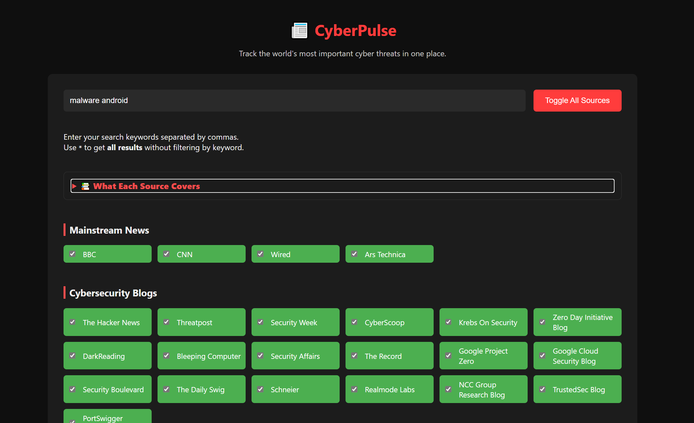
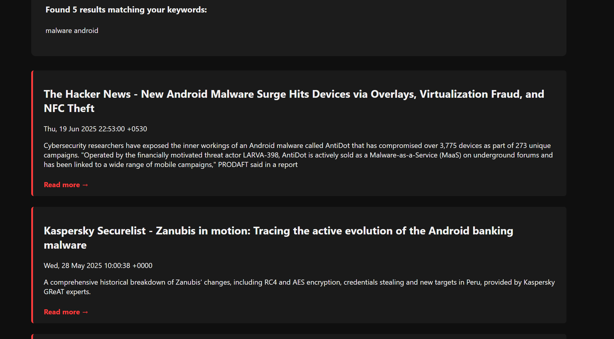

# 📰 CyberPulse

**CyberPulse** is a web-based tool for tracking and aggregating high-signal cybersecurity news and alerts from over 40 of the most trusted public sources. Whether you're a researcher, analyst, or just staying informed, CyberPulse helps you quickly discover the latest cyber threats, breaches, vulnerabilities, and more—all in one place.

## 📸 Screenshot

## 🔍 Features

- **Keyword Search**: Enter search terms (e.g. `ransomware`, `APT`, `malware finance`) to filter articles by relevance.
- **Wildcard Search**: Use `*` to fetch all recent articles without any keyword filtering.
- **Toggle All Sources**: Easily enable or disable all news feeds with a single click.
- **Categorized Sources**: Sources are grouped for easier navigation:
  - Mainstream News
  - Cybersecurity Blogs
  - Vendor & Research Feeds
  - Government & Law Enforcement
  - Community & Aggregators
- **High Coverage**: Over 90–95% coverage of public, high-signal cybersecurity sources.
- **Always Up to Date**: A background scraper runs every hour on the server, so results are fresh without any waiting.
- **Lightweight Interface**: Clean, fast static web app — no backend required on the client side.
- **No Ads / No Tracking**: 100% user-focused.

## 📎 How to Use

1. Open the app: **[https://insanecipher.github.io/CyberPulse](https://insanecipher.github.io/CyberPulse)**
2. Enter keywords (e.g. `zero-day`, `crypto hack`, `phishing`, `APT`).
3. Select the sources you want to include — or click **Toggle All Sources**.
4. Click **Search** to view results pulled from the live database.

> **Tip:** Enter `*` as the keyword to fetch **all recent articles** without filtering.

## 🏗️ Architecture

CyberPulse is split into two parts:

**Server (Hyperion)** — runs continuously on a self-hosted Ubuntu server:
- Scrapes 40+ sources every hour using `feedparser` and `BeautifulSoup`
- Stores articles in a **PostgreSQL** database (deduplication handled automatically)
- Serves results via a **FastAPI** REST API at `https://api.hyperionserver.uk`
- Exposed publicly via **Cloudflare Tunnel**

**Client (this repo)** — a single static `index.html`:
- Fetches articles directly from the API
- Filters by keyword and source entirely in the browser
- Hosted on **GitHub Pages** — works for anyone with no setup needed

## 🌐 Categories and Example Sources

- **Mainstream News**:  
  _BBC, CNN, Wired, Ars Technica_  
  Coverage of global-scale cyber events, nation-state incidents, and policy reactions.

- **Cybersecurity Blogs**:  
  _KrebsOnSecurity, The Hacker News, Google Project Zero, PortSwigger, NCC Group, TrustedSec_  
  Deep-dive reporting, vulnerability breakdowns, and security research.

- **Vendors & Feeds**:  
  _CrowdStrike, Microsoft, Cisco Talos, Palo Alto Networks, ExploitDB_  
  Technical advisories, threat intelligence, and exploit telemetry.

- **Government & Law Enforcement**:  
  _CISA (CERT-US), NCSC UK, FBI, Europol_  
  Public alerts, takedown operations, and cyber defense recommendations.

- **Community & Aggregators**:  
  _Risky Biz (Substack), Darknet Diaries_  
  Curated security news, expert commentary, and real-world incident retrospectives.

## 🚫 Limitations

- Twitter, Reddit, and Discord sources are **not included** due to lack of RSS or free API support.
- Some sources may go temporarily offline or restrict feed length.
- Results depend on the server scraper running — articles are refreshed hourly, not in real time.

---

**Built With:**

| Component | Technology |
|---|---|
| Scraper | Python, `feedparser`, `BeautifulSoup`, `lxml` |
| Database | PostgreSQL |
| API | FastAPI, uvicorn, slowapi |
| Tunnel | Cloudflare Tunnel |
| Frontend | HTML / CSS / Vanilla JS |
| Hosting | GitHub Pages (frontend), Self-hosted Ubuntu Server (backend) |
